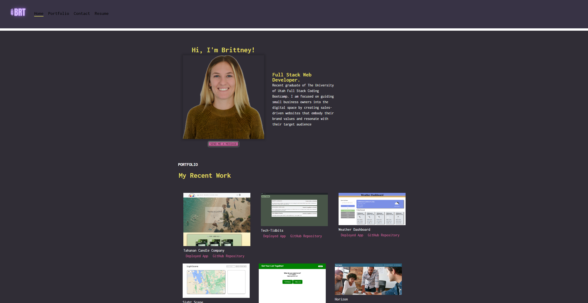

# My_Space/ Portfolio

## Description

AS AN employer looking for candidates with experience building single-page applications
I WANT to view a potential employee's deployed React portfolio of work samples
SO THAT I can assess whether they're a good candidate for an open position
## Table of Contents

If your README is long, add a table of contents to make it easy for users to find what they need.

- [Installation](#installation)
- [Usage](#usage)
- [Credits](#credits)
- [License](#license)

## Installation

What are the steps required to install your project? Provide a step-by-step description of how to get the development environment running.

## Usage

Provide instructions and examples for use. Include screenshots as needed.

    

    

## Credits

List your collaborators, if any, with links to their GitHub profiles.

If you used any third-party assets that require attribution, list the creators with links to their primary web presence in this section.

If you followed tutorials, include links to those here as well.

## License

The last section of a high-quality README file is the license. This lets other developers know what they can and cannot do with your project. If you need help choosing a license, refer to [https://choosealicense.com/](https://choosealicense.com/).

---

🏆 The previous sections are the bare minimum, and your project will ultimately determine the content of this document. You might also want to consider adding the following sections.

## Badges

Badges aren't necessary, per se, but they demonstrate street cred. Badges let other developers know that you know what you're doing. Check out the badges hosted by [shields.io](https://shields.io/). You may not understand what they all represent now, but you will in time.

## Features

If your project has a lot of features, list them here.

## How to Contribute

If you created an application or package and would like other developers to contribute it, you can include guidelines for how to do so. The [Contributor Covenant](https://www.contributor-covenant.org/) is an industry standard, but you can always write your own if you'd prefer.

## Tests

Go the extra mile and write tests for your application. Then provide examples on how to run them here.
